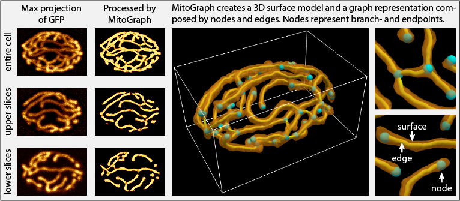

### MitoGraph

MitoGraph is a fully automated image processing method and software dedicated to calculating the three-dimensional morphology of mitochondria in live cells. MitoGraph is currently optimized and validated only for quantifying the volume and topology of tubular mitochondrial networks in budding yeast [1,2]. However, MitoGraph can also be applied to mitochondria in other cell types and possibly other intracellular (or tissue) structures, with proper validation. MitoGraph is continuously being updated and we hope to be able to accurately analyze mitochondrial network topology and, eventually dynamics. Please contact us if you have questions relating to these other applications that go beyond mitochondrial volume.

2018.01.08, Matheus Viana.

### V3.0 Release

✓ Adaptive threshold

✓ Support binary and VTK input

✓ Saves skeleton withh information of mitochondrial tubule width and pixel intensity

✓ Exports skeleton coordinates

---

### How to Install

Please follow the steps bellow to install MitoGraph.

1. Download the file that suits your operating system.

2. Create a new folder called MitoGraph on your Desktop.

3. Move the downloaded file to the folder you just created and rename the file to MitoGraph.

4. Open the terminal in your Mac OS (spotlight + terminal)

5. Type the following command (make sure that you are typing the space and upper cases correctly) and press return.

`cd ~/Desktop/MitoGraph`

PS: if any error message is displayed, please check the spelling of the directory that you have created.

6. Type the following command.

`chmod +xxx MitoGraph`

PS: if no error message is displayed it means that MitoGraph is ready to run.

---

### How to Run MitoGraph

Type the following command in the terminal.

`./MitoGraph -xy 0.056 -z 0.2 -path ~/Desktop/examples`

PS: The flag -xy specifies the pixel size in microns and the flag -z specifies the z-spacing also in microns of your images. Finally, the flag -path indicates the folder that contains the images you want to analyze.

#### Optional Flags

`-scales a b c` where a, b and c are numeric values specifying the initial, final and total number of scales which should be used by MitoGraph [1]. For example: `-scales 1.5 2.0 6`. Default values are a=1.0, b=1.5 and c=6.

`-threshold a` where a is numeric value in the range [0,1] for the post-divergence threshold. For example: `-threshold 0.1`. Default value is a=0.1667.

`-adaptive a` where a is a numeric integer value specifying that the input image should be split into a x a blocks before the segmentation. This is useful for images with high variablity of pixel intensity.

`-binary`: indicates that the input is a binary image. 

`-vtk`: indicates that the input data is of __VTK Imagedata__ type instead of TIFF.

`-labels_off`: turns off the labels of nodes in the output file __filename_nodes.vtk___.

---

### MitoGraph Outputs

The output of MitoGraph will be saved in the directory specified with `-path`.

**Single files:**

* __mitograph.config__ - Stores the parameters used to run MitoGraph and the data and time when the analysis was complete.

**Text files that can be open in any Text Editor (one file per sample):**

* __filename.gnet__ - Connection list of type `node_i` `node_j` of the graph that represents the mitochondria. First line of this file gives the total number of nodes.
* __filename.coo__ - Coordinates xyz of nodes in the graph.
* __filename.mitograph__ - Mitochondrial attributes: volume from voxels, average width (µm), std width (µm),  total length (µm) and volume from length (µm3).
* __filename.txt__ - Coordinates of all the points along the mitochondrial skeleton as well as the local width (µm) and original pixel intensity.

**Image files (one file per sample):**

* __filename.png__ - Max projection of mitochondria after MitoGraph binarization. Should be used for fast assessment of MitoGraph segmentation result.

**VTK files that can be open using Paraview [3] (one file per sample):**

* __filename_Nodes.vtk__ - Nodes of of the graph that represents the mitochondria and their labels.
* __filename_skeleton.vtk__ - Mitochondrial skeleton.
* __filename_mitosurface.vtk__ - Mitochondrial surface.

---

### Test Data

MitoGraph expects 8bit or 16bit TIFF z-stacks (or __VTK Imagedata__ type using the flag `-vtk`) as input to perform the analysis. To test MitoGraph, please click in the image below to download an example dataset.

---

### Tips

MitoGraph performs better over single cell images similar to the images from our test dataset. Here we provide two ImageJ macros that helps you to format your images in that way. If you have any questions about how to use these macros, please refer to [1] or contact us.

* <a href="https://sites.google.com/site/vianamp/GenFramesMaxProjs.ijm?attredirects=0&d=1">__GenMaxProjsFrom.ijm__</a> - generates a z-stack in which each slice corresponds to the maximum intensity projection of a given TIFF stack. To run this macro, open the macro file in ImageJ and click “Run” in the macro window. Then select the folder where the files are. A new file called MaxProjs.tif will be generated and saved into this same folder.

* <a href="https://sites.google.com/site/vianamp/CropCells.ijm?attredirects=0&d=1">__CropCells.ijm__</a> - takes the region bounded by the ROI in all frames of the original stack and pastes it into a new stack file. All of these new stack files, each containing only one cell, are automatically saved into a new /cells folder.

With help of Hill Lab, we also provide R scripts that will help you to analyze the data generated by MitoGraph. Please, check this out in <a href="https://github.com/Hill-Lab/MitoGraph-Contrib-RScripts">MitoGraph-Contrib-RScripts</a>.

---

### References

[1] - Matheus P Viana, Swee Lim, Susanne M Rafelski, Quantifying Mitochondrial Content in Living Cells (2015), Biophysical Methods in Cell Biology, (125) - 77-93 (http://www.sciencedirect.com/science/article/pii/S0091679X14000041)

[2] - Under revision.

[3] - https://www.paraview.org/
